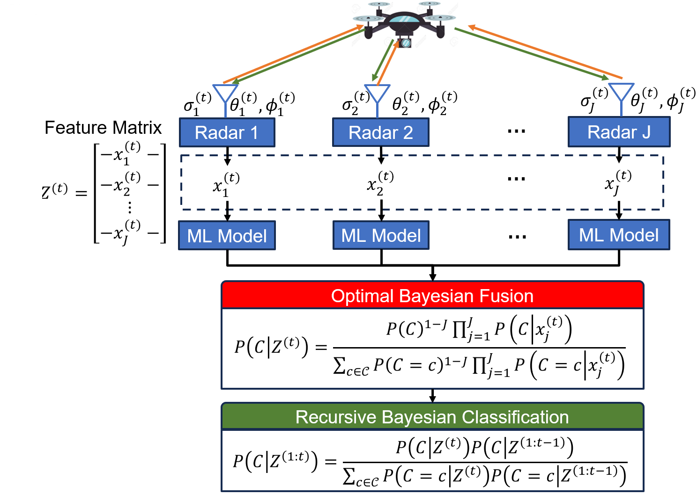

<!-- Improved compatibility of back to top link: See: https://github.com/othneildrew/Best-README-Template/pull/73 -->
<a name="readme-top"></a>
<!--
*** Thanks for checking out the Best-README-Template. If you have a suggestion
*** that would make this better, please fork the repo and create a pull request
*** or simply open an issue with the tag "enhancement".
*** Don't forget to give the project a star!
*** Thanks again! Now go create something AMAZING! :D
-->


<!-- PROJECT SHIELDS -->
<!--
*** I'm using markdown "reference style" links for readability.
*** Reference links are enclosed in brackets [ ] instead of parentheses ( ).
*** See the bottom of this document for the declaration of the reference variables
*** for contributors-url, forks-url, etc. This is an optional, concise syntax you may use.
*** https://www.markdownguide.org/basic-syntax/#reference-style-links
-->
<!-- [![Contributors][contributors-shield]][contributors-url]
[![Issues][issues-shield]][issues-url]-->
[![MIT License][license-shield]][license-url]

<!-- PROJECT LOGO -->
<br />
<div align="center">
  <a href="https://github.com/othneildrew/Best-README-Template">
    
  </a>

  <h1 align="center">ARL FREEDOM Project Task 2.2.2</h1>

</div>


<!-- Distributed Radar -->
# Multistatic-Radar RCS-Signature Recognition of Aerial Vehicles: A Bayesian Fusion Approach

<p align="center">
	
</p>

The first thrust of the FREEDOM project task 2.2.2 focused on Bayesian inference of a target UAV type classification using radar cross section (RCS) measurements in a multistatic radar configuration.

<p align="right">(<a href="#readme-top">back to top</a>)</p>


### Built With


<p align="right">(<a href="#readme-top">back to top</a>)</p>


<!-- GETTING STARTED -->
## Getting Started


### Prerequisites
1. Download and install [Anaconda](https://www.anaconda.com/) for python package management.
2. Create a virtual environment with python version 3.9
   ```sh
   conda create -n FREEDOM python=3.9
   ```
3. Activate the conda **FREEDOM** virtual environment
   ```sh
   conda activate FREEDOM
   ```
4. Clone the Github repo
   ```sh
   git clone https://github.com/mlpotter/RCS_ATR
   ```
5. Download RCS data from IEEE DataPort [here](https://ieee-dataport.org/open-access/drone-rcs-measurements-26-40-ghz) into ``RCS_ATR\Drone_RCS_Measurement_Dataset``

### Installation

1. Install python packages
   ```sh
   pip install -r requirements.txt
   ```
<p align="right">(<a href="#readme-top">back to top</a>)</p>

<!-- USAGE EXAMPLES -->
## Usage

To run a basic example of 3 radars tracking 4 targets over 1000 time steps, with the radars maintaining a distance of 125 meters from the targets.
<p align="right">(<a href="#readme-top">back to top</a>)</p>

```bash
# change to the folders related to mobile radars
cd RCS_ATR

python main_expectation.py --mlflow_track \
                           --experiment_name=radar_target_recognition_joke \
                           --SNR_constraint=-20 \
                           --model_choice=logistic \
                           --no-geometry \
                           --num_points=10000 \
                           --MC_Trials=10 \
                           --n_radars=4 \
                           --TN=100 \
                           --vx=50 \
                           --time_step_size=0.1 \
                           --yaw_range=np.pi/15 \
                           --pitch_range=np.pi/20 \
                           --roll_range=0 \
                           --fusion_method=fusion \
                           --noise_method=random \
                           --color=color \
                           --elevation_center=0 \
                           --elevation_spread=190 \
                           --azimuth_center=90 \
                           --azimuth_spread=180 \
                           --single_method=random \
                           --azimuth_jitter_bounds=0_180 \
                           --elevation_jitter_bounds=-90_90 \
                           --azimuth_jitter_width=20 \
                           --elevation_jitter_width=20 \
```
<p align="right">(<a href="#readme-top">back to top</a>)</p>

More details on experiment parameters may be found by running  `python main_expectation.py -h`

```commandline
python main_mc_trajectory_SNR.py -h
  -h, --help            show this help message and exit
  --num_points NUM_POINTS
                        Number of random points per class label (default: 1000)
  --MC_Trials MC_TRIALS
                        Number of MC Trials (default: 10)
  --n_radars N_RADARS   Number of radars in the xy grid (default: 16)
  --mlflow_track, --no-mlflow_track
                        Do you wish to track experiments with mlflow? --mlflow_track for yes --no-mlflow_track for no (default: False)
  --geometry, --no-geometry
                        Do you want az-el measurements in experiments? --geometry for yes --no-geometry for no (default: False)
  --fusion_method FUSION_METHOD
                        how to aggregate predictions of distributed classifier (default: average)
  --model_choice MODEL_CHOICE
                        Model to train (default: xgboost)
  --TN TN               Number of time steps for the experiment (default: 20)
  --vx VX               The Velocity of the Drone in the forward direction (default: 50)
  --yaw_range YAW_RANGE
                        The yaw std of the random drone walk (default: np.pi/8)
  --pitch_range PITCH_RANGE
                        The pitch std of the random drone walk (default: np.pi/15)
  --roll_range ROLL_RANGE
                        The roll std of the random drone walk (default: 0)
  --time_step_size TIME_STEP_SIZE
                        The Velocity of the Drone in the forward direction (default: 0.1)
  --noise_method NOISE_METHOD
                        The noise method to choose from (see code for examples) (default: random)
  --color COLOR         The type of noise (color,white) (default: white)
  --SNR_constraint SNR_CONSTRAINT
                        The signal to noise ratio (default: 0)
  --azimuth_center AZIMUTH_CENTER
                        azimuth center to sample for target single point RCS, bound box for random (default: 90)
  --azimuth_spread AZIMUTH_SPREAD
                        std of sample for target single point RCS, bound box for random (default: 5)
  --elevation_center ELEVATION_CENTER
                        elevation center to sample for target single point RCS, bound box for random (default: 0)
  --elevation_spread ELEVATION_SPREAD
                        std of sample for target single point RCS, bound box for random (default: 5)
  --single_method SINGLE_METHOD
                        target is for sampling around some designated point, random is to sample uniformly over grid (default: target)
  --azimuth_jitter_width AZIMUTH_JITTER_WIDTH
                        the width of the jitter for azimuth (default: 10)
  --azimuth_jitter_bounds AZIMUTH_JITTER_BOUNDS
                        lower and upper bound of the azimuth when adding noise to clip (default: 0_180)
  --elevation_jitter_width ELEVATION_JITTER_WIDTH
                        the width of the jitter for elevation (default: 10)
  --elevation_jitter_bounds ELEVATION_JITTER_BOUNDS
                        lower and upper bound of the elevation when adding noise to clip (default: -90_90)
  --experiment_name EXPERIMENT_NAME
                        experimennt name for MLFLOW (default: radar_target_recognition)
  --random_seed RANDOM_SEED

```

<!-- CONTACT -->
# Contact

Michael Potter - [linkedin](https://www.linkedin.com/in/michael-lynn-potter/) - potter.mi@northeastern.edu <br />
<p align="right">(<a href="#readme-top">back to top</a>)</p>


<!-- ACKNOWLEDGMENTS -->
# Acknowledgments
> Research was sponsored by the Army Research Laboratory and was accomplished under Cooperative Agreement Number W911NF-23-2-0014. The views and conclusions contained in this document are those of the authors and should not be interpreted as representing the official policies, either expressed or implied, of the Army Research Laboratory or the U.S. Government. The U.S. Government is authorized to reproduce and distribute reprints for Government purposes notwithstanding any copyright notation herein.

# Citing This Paper
Please cite the following paper if you intend to use this code or dataset for your research.
> @misc{potter2024multistaticradar,
    title={Multistatic-Radar RCS-Signature Recognition of Aerial Vehicles: A Bayesian Fusion Approach},
    author={Michael Potter and Murat Akcakaya and Marius Necsoiu and Gunar Schirner and Deniz Erdogmus and Tales Imbiriba},
    year={2024},
    eprint={2402.17987},
    archivePrefix={arXiv},
    primaryClass={eess.SP}
}

<!-- MARKDOWN LINKS & IMAGES -->
<!-- https://www.markdownguide.org/basic-syntax/#reference-style-links -->
[contributors-shield]: https://img.shields.io/github/contributors/othneildrew/Best-README-Template.svg?style=for-the-badge
[contributors-url]: https://github.com/othneildrew/Best-README-Template/graphs/contributors
[forks-shield]: https://img.shields.io/github/forks/othneildrew/Best-README-Template.svg?style=for-the-badge
[forks-url]: https://github.com/othneildrew/Best-README-Template/network/members
[stars-shield]: https://img.shields.io/github/stars/othneildrew/Best-README-Template.svg?style=for-the-badge
[stars-url]: https://github.com/othneildrew/Best-README-Template/stargazers
[issues-shield]: https://img.shields.io/github/issues/othneildrew/Best-README-Template.svg?style=for-the-badge
[issues-url]: https://github.com/neu-spiral/FREEDOM221/issues
[license-shield]: https://img.shields.io/github/license/othneildrew/Best-README-Template.svg?style=for-the-badge
[license-url]: https://github.com/othneildrew/Best-README-Template/blob/master/LICENSE.txt
[linkedin-shield]: https://img.shields.io/badge/-LinkedIn-black.svg?style=for-the-badge&logo=linkedin&colorB=555
[linkedin-url]: https://linkedin.com/in/othneildrew
[product-screenshot]: images/screenshot.png
[Next.js]: https://img.shields.io/badge/next.js-000000?style=for-the-badge&logo=nextdotjs&logoColor=white
[Next-url]: https://nextjs.org/
[React.js]: https://img.shields.io/badge/React-20232A?style=for-the-badge&logo=react&logoColor=61DAFB
[React-url]: https://reactjs.org/
[Vue.js]: https://img.shields.io/badge/Vue.js-35495E?style=for-the-badge&logo=vuedotjs&logoColor=4FC08D
[Vue-url]: https://vuejs.org/
[Angular.io]: https://img.shields.io/badge/Angular-DD0031?style=for-the-badge&logo=angular&logoColor=white
[Angular-url]: https://angular.io/
[Svelte.dev]: https://img.shields.io/badge/Svelte-4A4A55?style=for-the-badge&logo=svelte&logoColor=FF3E00
[Svelte-url]: https://svelte.dev/
[Laravel.com]: https://img.shields.io/badge/Laravel-FF2D20?style=for-the-badge&logo=laravel&logoColor=white
[Laravel-url]: https://laravel.com
[Bootstrap.com]: https://img.shields.io/badge/Bootstrap-563D7C?style=for-the-badge&logo=bootstrap&logoColor=white
[Bootstrap-url]: https://getbootstrap.com
[JQuery.com]: https://img.shields.io/badge/jQuery-0769AD?style=for-the-badge&logo=jquery&logoColor=white
[JQuery-url]: https://jquery.com 
[jax-url]: https://github.com/google/jax
[jax.com]: https://img.shields.io/badge/JAX-Accelerated-9cf.svg?style=flat-square&logo=data:image/png;base64,iVBORw0KGgoAAAANSUhEUgAAAC0AAAAaCAYAAAAjZdWPAAAIx0lEQVR42rWWBVQbWxOAkefur%2B7u3les7u7F3ZIQ3N2tbng8aXFC0uAuKf2hmlJ3AapIgobMv7t0w%2Ba50JzzJdlhlvNldubeq%2FY%2BXrTS1z%2B6sttrKfQOOY4ns13ecFImb47pVvIkukNe4y3Junr1kSZ%2Bb3Na248tx7rKiHlPo6Ryse%2F11NKQuk%2FV3tfL52yHtXm8TGYS1wk4J093wrPQPngRJH9HH1x2fAjMhcIeIaXKQCmd2Gn7IqSvG83BueT0CMkTyESUqm3vRRggTdOBIb1HFDaNl8Gdg91AFGkO7QXe8gJInpoDjEXC9gbhtWH3rjZ%2F9yK6t42Y9zyiC1iLhZA8JQe4eqKXklrJF0MqfPv2bc2wzPZjpnEyMEVlEZCKQzYCJhE8QEtIL1RaXEVFEGmEaTn96VuLDzWflLFbgvqUec3BPVBmeBnNwUiakq1I31UcPaTSR8%2B1LnditsscaB2A48K6D9SoZDD2O6bELvA0JGhl4zIYZzcWtD%2BMfdvdHNsDOHciXwBPN18lj7sy79qQCTNK3nxBZXakqbZFO2jHskA7zBs%2BJhmDmr0RhoadIZjYxKIVHpCZngPMZUKoQKrfEoz1PfZZdKAe2CvP4XnYE8k2LLMdMumwrLaNlomyVqK0UdwN%2BD7AAz73dYBpPg6gPiCN8TXFHCI2s7AWYesJgTabD%2FS5uXDTuwVaAvvghncTdk1DYGkL0daAs%2BsLiutLrn0%2BRMNXpunC7mgkCpshfbw4OhrUvMkYo%2F0c4XtHS1waY4mlG6To8oG1TKjs78xV5fAkSgqcZSL0GoszfxEAW0fUludRNWlIhGsljzVjctr8rJOkCpskKaDYIlgkVoCmF0kp%2FbW%2FU%2F%2B8QNdXPztbAc4kFxIEmNGwKuI9y5gnBMH%2BakiZxlfGaLP48kyj4qPFkeIPh0Q6lt861zZF%2BgBpDcAxT3gEOjGxMDLQRSn9XaDzPWdOstkEN7uez6jmgLOYilR7NkFwLh%2B4G0SQMnMwRp8jaCrwEs8eEmFW2VsNd07HQdP4TgWxNTYcFcKHPhRYFOWLfJJBE5FefTQsWiKRaOw6FBr6ob1RP3EoqdbHsWFDwAYvaVI28DaK8AHs51tU%2BA3Z8CUXvZ1jnSR7SRS2SnwKw4O8B1rCjwrjgt1gSrjXnWhBxjD0Hidm4vfj3e3riUP5PcUCYlZxsYFDK41XnLlUANwVeeILFde%2BGKLhk3zgyZNeQjcSHPMEKSyPPQKfIcKfIqCf8yN95MGZZ1bj98WJ%2BOorQzxsPqcYdX9orw8420jBQNfJVVmTOStEUqFz5dq%2F2tHUY3LbjMh0qYxCwCGxRep8%2FK4ZnldzuUkjJLPDhkzrUFBoHYBjk3odtNMYoJVGx9BG2JTNVehksmRaGUwMbYQITk3Xw9gOxbNoGaA8RWjwuQdsXdGvpdty7Su2%2Fqn0qbzWsXYp0nqVpet0O6zzugva1MZHUdwHk9G8aH7raHua9AIxzzjxDaw4w4cpvEQlM84kwdI0hkpsPpcOtUeaVM8hQT2Qtb4ckUbaYw4fXzGAqSVEd8CGpqamj%2F9Q2pPX7miW0NlHlDE81AxLSI2wyK6xf6vfrcgEwb0PAtPaHM1%2BNXzGXAlMRcUIrMpiE6%2Bxv0cyxSrC6FmjzvkWJE3OxpY%2BzmpsANFBxK6RuIJvXe7bUHNd4zfCwvPPh9unSO%2BbIL2JY53QDqvdbsEi2%2BuwEEHPsfFRdOqjHcjTaCLmWdBewtKzHEwKZynSGgtTaSqx7dwMeBLRhR1LETDhu76vgTFfMLi8zc8F7hoRPpAYjAWCp0Jy5dzfSEfltGU6M9oVCIATnPoGKImDUJNfK0JS37QTc9yY7eDKzIX5wR4wN8RTya4jETAvZDCmFeEPwhNXoOlQt5JnRzqhxLZBpY%2BT5mZD3M4MfLnDW6U%2Fy6jkaDXtysDm8vjxY%2FXYnLebkelXaQtSSge2IhBj9kjMLF41duDUNRiDLHEzfaigsoxRzWG6B0kZ2%2BoRA3dD2lRa44ZrM%2FBW5ANziVApGLaKCYucXOCEdhoew5Y%2Btu65VwJqxUC1j4lav6UwpIJfnRswQUIMawPSr2LGp6WwLDYJ2TwoMNbf6Tdni%2FEuNvAdEvuUZAwFERLVXg7pg9xt1djZgqV7DmuHFGQI9Sje2A9dR%2FFDd0osztIRYnln1hdW1dff%2B1gtNLN1u0ViZy9BBlu%2BzBNUK%2BrIaP9Nla2TG%2BETHwq2kXzmS4XxXmSVan9KMYUprrbgFJqCndyIw9fgdh8dMvzIiW0sngbxoGlniN6LffruTEIGE9khBw5T2FDmWlTYqrnEPa7aF%2FYYcPYiUE48Ul5jhP82tj%2FiESyJilCeLdQRpod6No3xJNNHeZBpOBsiAzm5rg2dBZYSyH9Hob0EOFqqh3vWOuHbFR5eXcORp4OzwTUA4rUzVfJ4q%2FIa1GzCrzjOMxQr5uqLAWUOwgaHOphrgF0r2epYh%2FytdjBmUAurfM6CxruT3Ee%2BDv2%2FHAwK4RUIPskqK%2Fw4%2FR1F1bWfHjbNiXcYl6RwGJcMOMdXZaEVxCutSN1SGLMx3JfzCdlU8THZFFC%2BJJuB2964wSGdmq3I2FEcpWYVfHm4jmXd%2BRn7agFn9oFaWGYhBmJs5v5a0LZUjc3Sr4Ep%2FmFYlX8OdLlFYidM%2B731v7Ly4lfu85l3SSMTAcd5Bg2Sl%2FIHBm3RuacVx%2BrHpFcWjxztavOcOBcTnUhwekkGlsfWEt2%2FkHflB7WqKomGvs9F62l7a%2BRKQQQtRBD9VIlZiLEfRBRfQEmDb32cFQcSjznUP3um%2FkcbV%2BjmNEvqhOQuonjoQh7QF%2BbK811rduN5G6ICLD%2BnmPbi0ur2hrDLKhQYiwRdQrvKjcp%2F%2BL%2BnTz%2Fa4FgvmakvluPMMxbL15Dq5MTYAhOxXM%2FmvEpsoWmtfP9RxnkAIAr%2F5pVxqPxH93msKodRSXIct2l0OU0%2FL4eY506L%2B3GyJ6UMEZfjjCDbysNcWWmFweJP0Jz%2FA0g2gk80pGkYAAAAAElFTkSuQmCC
